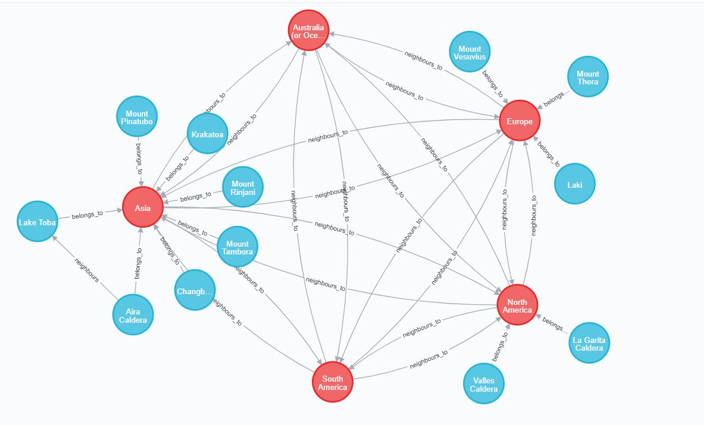

## Neo4j-World-Volcanoes-Visualization

**Group 2**

**Name: Aakash Patel, Student ID: B00807065**
**Name: Agbola Iseoluwatobi, Student ID: B00802526**

### Project Overview

The Project involved extracting data about volcanoes from the provided link and importing the data into the Neo4j graph database. The data was converted to a graph model which involved representing the continents and volcanoes as nodes, then establishing the relationships between them. The project involves performing using analytics and visualizations with cypher queries and then displaying the continent with the most super volcanoes.

**Figure 1 Continent with the most super volcanoes**

### Significance of Neo4j

Neo4j is used for representing data that is based on relationships and can be represented by the graph model. Neo4j has a variety of features which enhances its significance. The features are as follows:
• Speed: Neo4j has constant time retrievals for breath and depth-first search. The database produces fast results for all query searches and can perform efficiently millions of nodes.
• Flexibility: Neo4j possesses a flexible graph schema and this schema can adapt to a changing data model which gives the database a large amount of flexibility.
• Scalability: Neo4j has a great amount of reading and write scalability which enables it to perform on large datasets without compromising data integrity with features like a fast write buffer.

### Limitations of Neo4j

• Data Representation Limitations: Some Datasets that cannot be accurately represented with relationships so it will difficult to convert and represent this data in a graph database.
• Data partitioning Limitations: storing a graph model on multiple partitions can be difficult because most queries would need to have access to all the partitions. This makes storing large dataset an issue because graphs are not horizontally scalable.
• Limitations with model restrictions: some relationships cannot be represented within a graph model and it would be difficult to accurately represent them in the graph database. this can produce data inconsistency which can reduce the usefulness of the application. For example, Neo4j nodes cannot have relationships to themselves but the real world might require data to represent that scenario.

### Contributions

- Firstly, we had a discussion for the installation procedure and configuration related tasks then we decided on the best approach to handle the problem statement.
- Then we worked individually to handle the project requirements.

Aakash Patel:
▪ Going through documentation and understand building Cypher queries.
▪ Preprocessing, Loading the data and resolving some issues faced for the same.
▪ Making nodes from the data and providing necessary attributes.
▪ Creating relationships among data and querying the same to display results.

Agbola Iseoluwatobi:
▪ Going through Project requirement and approach.
▪ Gathering and pre-processing data.
▪ Exploring alternative approaches for creating the graph model and performing queries.
▪ Visualization and analytics for the continent with the most super volcanoes.

### REFERENCES

[1]. Neo4j Graph Database Platform. (2019). Neo4j Graph Platform – The Leader in Graph Databases. Available at: https://neo4j.com/
[2]. Hal.inria.fr. (2019). Available at: https://hal.inria.fr/hal-01444505/document.
[3]. "Neo4j Tutorial", Quackit.com, 2019. Available: https://www.quackit.com/neo4j/tutorial/.
